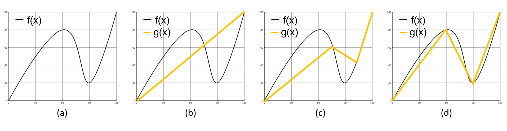

# Genetic Piecewise Linear Approximation

**GPLA**(Genetic Piecewise Linear Approximation) is the method to search automatically optimal linear pieces using **GA**(Genetic Algorithm), when using **PLA**(Piecewise Linear Approximation) algorithm to approximate a function.

To understand **GPLA**, you should know **PLA**.

## Piecewise Linear Approximation

**PLA** is one method to approximate a single valued function of one variable in terms of a sequence of linear pieces.

Figure 1. A function (blue) and a piecewise linear approximation to it (red).

### Limitations

Obviously, a function can be approximated almost perfectly using PLA, if we use an infinite number of linear pieces to fit the curve with an infinite memory. However, the memory is finite. So, it is important to decide **the proper number of linear pieces** and **the boundary of each piece** to approximate accurately a function.

To help you understand, Let me give you an example.

Assume that we have the function f(x) like the below Figure 2 and the function g(x) is the approximated f(x) using PLA.

Figure 2. The resutls of PLA to a function g(x) (black). (b) is approximated by a one piece. (c) and (d) are approximated by three pieces. (c) is  failed to segment the boundary of each piece. (d) seems like to be approximated well. 

Although we decide **the proper number of linear pieces** like (c) as shown in Figure 2, if we failed to **decide the boundary of each 
piece**, we will not approximate a function with high accuracy.

In this project, I propose the method to search the boundary of each piece automatically using GA when the number of linear pieces is set manually.
